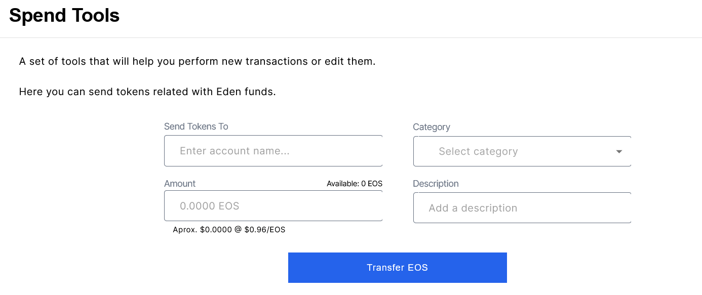
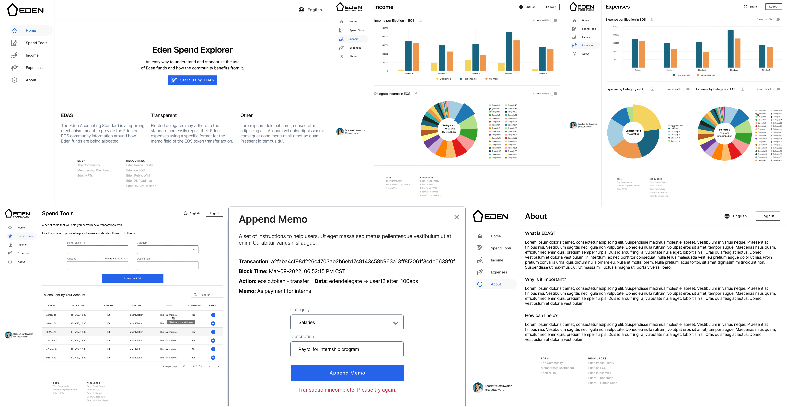

<p align="center">
   
</p>

# Eden Delegates Accounting Standard

**Income and Expense Tracking Standard for Eden on EOS Delegates**

    

The Eden Accounting Standard is a reporting mechanism meant to provide the Eden and EOS community information around how Eden funds are being allocated. Elected delegates may adhere to the standard and easily report their Eden expenses using a specific format for the memo field of the EOS token transfer action.

The Eden community’s feedback and engagement is critical to the success of the project. We hope to make this effort as collaborative and easy to use as possible as the quality of the reports generated are a direct result of the level of participation of the Eden delegates

The list of active delegates and their Income will be automatically sourced from `genesis.eden` smart contract when delegates withdraw Eden funds to their accounts.

Expenses are then picked up automatically by the application by interpreting the memo field messages that delegates must include using the standard EOS token transfer contract.

The memo field must follow a specific format in order to :

- **Identify** the token transfer as an Eden delegates expense.
- **Categorize** the expense into one of several predefined categories.
- **Describe** with additional information on the nature of the expense.

If a delegate chooses not to apply the memo format, their transactions will still be tracked but their reports will show all expenses as “uncategorized.”

## Transaction Memo Format

Delegates may include any expense into the reporting system by using the following memo format:

**`eden_expense: <category>/<description>`**

- **eden_expense** is a general prefix to identify this expense as related to Eden, it must be followed by a colon :

- **category** must be one of several predefined category keywords that best describes the nature of the expense. The category must then be followed by a forward slash /

- **description** is a free-form short text that describes the use of Eden funds.

The following is an example EOS token transfer memo using the Eden expense tracking format:

**`eden_expense: salaries/payroll for internship program`**

### Expense Categories

Category names are limited to a single word so that they can be used as keywords in the transaction memos.

We have provided the following initial list of categories and would like to ask the Eden Delegates for suggestions on new expense categories.

| Category Name  | Description                         |
| -------------- | ----------------------------------- |
| admin          | General Administrative              |
| charity        | ​​Charitable Donations              |
| development    | Software and Web Development        |
| dues           | Dues and Subscriptions              |
| education      | Educational Courses and Materials   |
| hardware       | Computer hardware                   |
| infrastructure | Web Hosting and Servers             |
| legal          | Legal and Professional Fees         |
| marketing      | Media and Outreach                  |
| pomelo         | Pomelo Projects Support             |
| salaries       | Salaries and Payroll                |
| software       | Software Licenses and Subscriptions |
| travel         | Travel Expenses                     |
| uncategorized  | Default for non reported expenses   |

#### Example Transaction

Follow this link to see an [Example Eden expense transaction memo](https://bloks.io/transaction/d0741b3361900c7d79e08bc9b2675fcb1779de4aa813f0418bed76d21678732f):

<p align="center">
   
</p>

#### UI Proposal

The treasury page will present visual information based on the EDAS categories, this will help delegates and other eden members to easily understand what's being done with the funds. A new page with a simple token transfer form will help delegates transact and document their expenses without any added complexity.

<p align="center">
   
</p>

## Eden Smart Contract Integration

The expense tracking platform will source all active Eden delegate’s accounts from the [`genesis.eden`](https://eosauthority.com/account/genesis.eden?network=eos) smart contracts.

Every time an election occurs the delegate's accounts will be included in the list of accounts that will be automatically tracked to capture all expense reporting information via the transaction memos.

All income will also be automatically tracked every time a delegate claims their funds.

### Token Transfer Event Listener

The application backend service will track all token transfers originating from Eden delegates EOS accounts.

When a token transfer includes the transaction memo format this will be parsed and used to populate the database and automatically track and categorize the expenses.

### Database fields

The database will persist the following data for EOS token transfers that involve an Eden delegates account:

| Field Name      | Type             | Description                   |
| --------------- | ---------------- | ----------------------------- |
| **txid**        | SHA256           | Token Transfer Transaction ID |
| **date**        | Date             | Transaction Date              |
| **type**        | text             | Income or Expense             |
| **delegate**    | EOS Account Name | Eden Delegate’s Account       |
| **election**    | Integer          | Eden Election Round           |
| **amount**      | Number           | Transfer Amount in EOS        |
| **recipient**   | EOS Account Name | Receiver of Funds             |
| **category**    | Text             | Expense Category              |
| **description** | Text             | Transaction description       |

Data can then be aggregated to be displayed on a web application with graphs and other data visualizations.

## Data Visualization and Reporting

Some interesting data visualizations to be included in the dashboard could be :

**Expenses by category pie chart**

- Total Expenses By Category per Delegate
- Total Expenses by Category for all delegates
- Total Expenses by Category for all chief delegates
- Total Expenses by Category for all level 1 delegates

**Expenses over time line graph**

- Expenses over time per Delegate
- Expenses over time for all delegates
- Expenses over time for all chief delegates
- Expenses over time for all level 1 delegates

**Total Expenses**

- Total expenses reported by each delegate
- The top 10 largest Eden expenses this election cycle
- The top accounts receivers of Eden funds
- Total number of expenses
- Average number of expenses
- Average expense size

**Expenses across eden rounds**

- round 1 expenses vs round 2 expenses etc.

## Event Listener

We are inspired by the [Demux Pattern](https://github.com/EOSIO/demux-js) to develop a backend service for sourcing blockchain events to deterministically update queryable datastores and trigger side effects.

### Demux Pattern Data Flow

<p align="center">
   
</p>

1. Client sends transaction to blockchain
1. Action Watcher invokes Action Reader to check for new blocks
1. Action Reader sees transaction in new block, parses actions
1. Action Watcher sends actions to Action Handler
1. Action Handler processes actions through Updaters and Effects
1. Actions run their corresponding Updaters, updating the state of the Datastore
1. Actions run their corresponding Effects, triggering external events
1. Client queries API for updated data

### Subscribe to Smart Contract Actions

We will use the Hyperion history service's ability to query blockchain events to listen for transactions and trigger side effects outside of the blockchain. The blockchain remains as the single source of truth for all application state nonetheless.

The backend service will subscribe to the following smart contract actions required in order to trigger updates when Eden specific token transfers occur on chain.

- **genesis.eden::electprocess** Triggers process that sources all accounts with an `election_rank > 0` from the `genesis.eden` contract's [members table](https://bloks.io/account/genesis.eden?loadContract=true&tab=Tables&table=member&account=genesis.eden&scope=&limit=100) when elections take place.

- **genesis.eden::withdraw** Triggers a database entry that registers Eden income for a given delegate account.

- **eosio.token::transfer** Triggers a database entry when an Eden del action that updates referral when invitee completes KYC for a new account.

## System Components

This application features the following technology stack :

- **React JS** : A Front End Web Application Framework.
- **Hapi** : Node JS HTTP API.
- **Hyperion** : Hyperion Full History API.
- **Hasura** : GraphQL Engine for PostgreSQL Database.
- **EOSIO** : Blockchain protocol with industry-leading transaction speed.
- **Kubernetes** : Docker Container Orchestration.

<p align="center">
   
</p>

### EOSIO Blockchain Integration

This project is being developed on the [Jungle Testnet](https://jungle.eosio.online/) using the [`genesisdeden`](hhttps://jungle3.bloks.io/account/genesisdeden) smart contract account. This contract is a copy of the current smart contract used by Eden on EOS.

The backend service is currently using [Edenia's testnet API Node](https://jungle.edenia.cloud/v1/chain/get_info)

We use the [EOS JS](https://github.com/EOSIO/eosjs) javascript API for integration with EOSIO-based blockchain networks using EOSIO RPC API.

EOS JS documentation can be found [here](https://developers.eos.io/manuals/eosjs/latest/index)

### Web Application

This FullStack Template uses [React.js](https://reactjs.org) as a Frontend Library which together with other tools like [Apollo Client](https://www.apollographql.com/docs/react/), [GraphQL](https://graphql.org/) and [Material UI](https://material-ui.com/) brings a robust solution for building Single Page Applications out of the box.

### Hasura GraphQL Engine

[Hasura](https://hasura.io/) technology maps a [PostgreSQL](https://www.postgresql.org/) database and provides a reliable and easy-to-use API. This allow us to focus on critical features of our projects, delegating mechanic CRUD (Create, Read, Update, Delete) operations.

Hasura also enables custom REST handling capabilities with the possibility to integrate a custom REST server, that way we can extend the base CRUD functionalities and build custom business logic.

### Hapi REST Server

The Hyperion event listener is configured withing the HAPI nodeJS backend service. We also need to handle REST custom requests coming from the Hasura GraphQL server. For this, we will use [hapi.dev](https://hapi.dev/), which is a simple and easy-to-use backend framework.

## File Structure

Within this repository you will find the following directories and files:

```
.
├── docs .......................... Documentation
│   └── images .................... Images and Diagrams
├── hapi .......................... Node JS backend & HTTP API
│   └── src
│       └── config ................ Backend Configurations
│       └── routes ................ HTTP routes
│       └── utils ................. Utilities and Libraries
│       └── services .............. Project Business Logic
|           └── hyperion .......... Demux Implementation
├── hasura ........................ Hasura GraphQL Engine
├── kubernetes .................... Kubernetes Manifests
├── utils ......................... Makefiles for project build
└── webapp ........................ ReactJS Web Application
```

## Installation

### Before you Start

Some things you need before getting started:

- [WSL and Ubuntu 18.04 LTS:](https://www.public-health.uiowa.edu/it/support/kb48549/) If you are using Windows operative system you will need to install **WSL** and **Ubuntu 18.04.5 LTS**. You can do it following this steps.
- [Git:](https://git-scm.com/) You will need to use git to clone and colaborate in this repository.
- [Docker Desktop:](https://www.docker.com/products/docker-desktop/) You will need docker and docker compose to run different images. When you have Docker Desktop installed you have to go to **settings** then **Resources** after that select **WSL Integration** and active the swich.
- [Nodejs:](https://nodejs.org/es/) This installation also depents of the operative system.
- [Yarn:](https://classic.yarnpkg.com/lang/en/docs/install/#windows-stable) You have to install first **npm** for then install **yarn**. The installation depents of the operative system.
- [Hasura CLI:](https://hasura.io/docs/latest/getting-started/index/) You will need it to handle DB.

### First Time

Copy the `.env.example` then update the environment variables according to your needs.

```
cp .env.example .env
```

### Quick Start

1.  Clone this repo using `git clone --depth=1 https://github.com/edenia/eden-spend-explorer <YOUR_PROJECT_NAME>`.
2.  Move to the appropriate directory: `cd <YOUR_PROJECT_NAME>`.
3.  Run `make run` in order to start the project using docker compose.

At this point you can navigate to `http://localhost:3000`.

# Contributing

Please read Edenia's [Open Source Contributing Guidelines](https://developers.eoscostarica.io/docs/open-source-guidelines).

Please report bugs big and small by [opening an issue](https://github.com/edenia/eden-spend-explorer/issues/new/choose)

## About Edenia

<div align="center">

<a href="https://edenia.com">
	</img>
</a>

[](https://twitter.com/edeniaWeb3)
[](https://discord.gg/YeGcF6QwhP)

</div>

Edenia runs independent blockchain infrastructure and develops web3 solutions. Our team of technology-agnostic builders has been operating since 1987, leveraging the newest technologies to make the internet safer, more efficient, and more transparent.

[edenia.com](https://edenia.com/)
